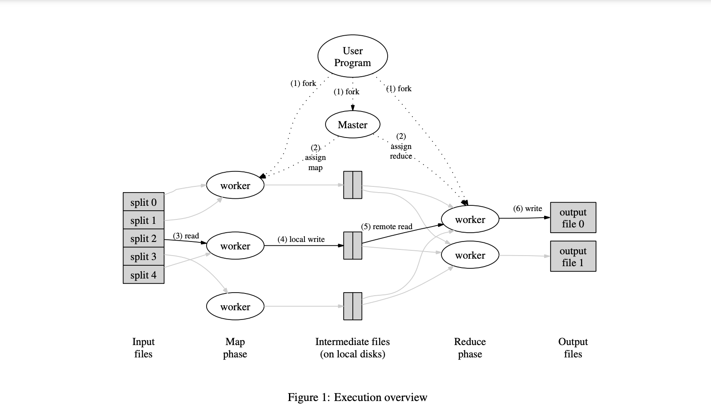

# Notepad

Place for me to jot notes, ideas, and references for the lab.

## Boilerplate

- [ ] No access to class boilerplate files. Write it.
  - [ ] Stand up an RPC server.
  - [ ] Create a configuration file for the server.

The course provides the students a series of boilerplate files to get started. These likely control the process spawning and server/network configuration.

Per Figure 1 of Dean and Ghemawat, it's one process for submitting the job, one for receiving/coordinating, and one for each worker. To keep things simple, we will stick to the paper and have the user program spawn the coordinator and workers.

## Rust RPC

- [x] No native RPC library for Rust. Find one.

~~[toy-rpc](https://crates.io/crates/toy-rpc) is an RPC library similar to the Go RPC library used in the course. It is not a drop-in replacement, but it is close enough to be useful.~~

[tarpc](https://crates.io/crates/tarpc) is an RPC library maintained by Google. It has substantially more downloads (2.5M vs 18k at time of writing) and is a better long-term bet for learning.

## Networking

- [ ] Create a client to connect to the server.
- [ ] Create an RPC commands for map.
- [ ] Create Count/Sum/Average RPC commands for reduce.

## Data

- [ ] Generate test input/evaluation data.
