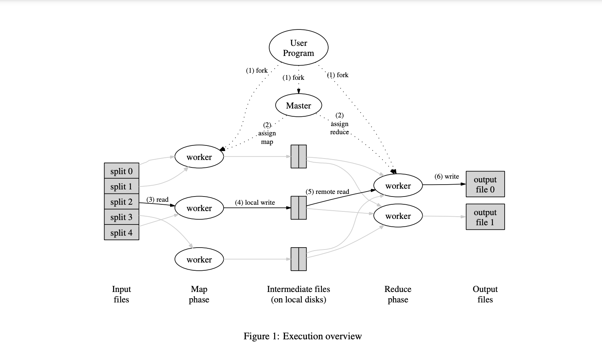
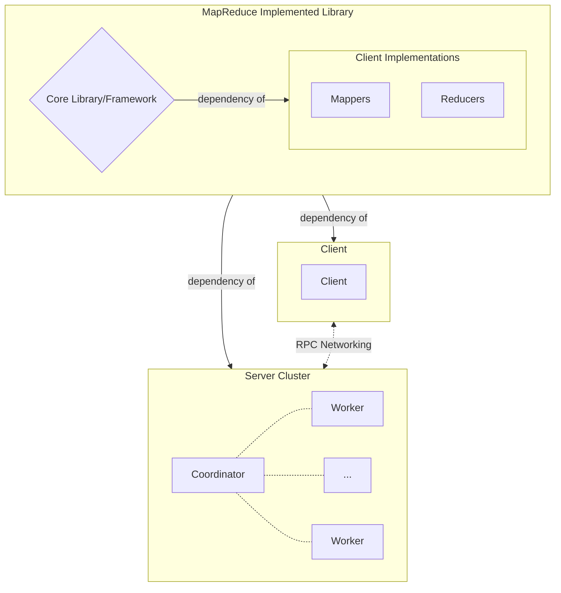

# Notepad

Place for me to jot notes, ideas, and references for the lab.

## Boilerplate

The course provides the students a series of boilerplate files to get started. These likely control the process spawning and server/network configuration.

Per Figure 1 of Dean and Ghemawat, it's one process for submitting the job, one for receiving/coordinating, and one for each worker. To keep things simple, we will stick to the paper and have the user program spawn the coordinator and workers.

## Code Design

The exact design of the client vs server API is not specified in the paper. It's somewhat unclear how the client shares the exact code to run for mapping and reducing. I can't imagine the system sends arbitrary code over the network and the server executes it, so my guess is that the code is an implementation of some MapReduce abstract classes. This completely constrains the MapReduce component to a framework that must be implemented. The extra library with specific map and reduce functions are written by the user after importing the framework. Only problem is that it raises the complexity of this project substantially, but we'll see how it goes.

- [ ] Write core library
  - [ ] Write Job container and dependencies
  - [ ] Write API for Mappers and Reducers
  - [ ] Write server
    - [ ] Write coordinator process
    - [ ] Write worker process
    - [ ] Write fault tolerance
    - [ ] Write coordinator/worker networking 1
    - [ ] Optionals
      - [ ] Consolidator
      - [ ] Custom partitioning
  - [ ] Write client
    - [ ] Write client process
  - [ ] Write client/server RPC networking 2,3
- [ ] Write example MapReduce functions
  - [ ] Write Term-Vector
  - [ ] Write Grep
  - [ ] Write Reverse Index

1 I'm a bit uncertain of how I should connect the coordinator/worker. RPC? Seems inappropriate since a lot of the back and forth will be stateful (task progress, error reporting, task submitting, etc.). Tempted to just go for a REST.

2 Do I write this into the actual client object used to submit jobs? I think so, but RPC feels like it's overcomplicating things. One client with a simple command: run_job. Maybe fancier: job_status. Takes simple inputs: mapper, reducer, input dir, output dir, etc. I need to think harder about this.

3 The way that Dean and Ghemawat display it in their graph makes it seem like the client and server are also abstracts int the framework, implemented by the programmer. Each function added can be wrapped as an RPC call. It makes sense, but I'm partial to abstracting a lot of this away as a single REST call.

### Sources

- [Guide](https://www.oreilly.com/library/view/mapreduce-design-patterns/9781449341954/ch01.html)
- [Hadoop Docs](https://hadoop.apache.org/docs/r1.2.1/mapred_tutorial.html#Inputs+and+Outputs)
- [Presentation](http://torlone.dia.uniroma3.it/bigdata/L2-Hadoop.pdf)
- [Archived Apache Hadoop GitHub](https://github.com/apache/hadoop-mapreduce/tree/trunk)
- [Apache Spark (Python) GitHub](https://github.com/apache/spark/tree/master/python/pyspark)

## Rust RPC

- [x] No native RPC library for Rust. Find one.

~~[toy-rpc](https://crates.io/crates/toy-rpc) is an RPC library similar to the Go RPC library used in the course. It is not a drop-in replacement, but it is close enough to be useful.~~

[tarpc](https://crates.io/crates/tarpc) is an RPC library maintained by Google. It has substantially more downloads (2.5M vs 18k at time of writing) and is a better long-term bet for learning.

## Data

- [x] Generate test input data.
- [ ] Create a test evaluation file.
  - [ ] Term-Vector
  - [ ] Grep
  - [ ] Reverse Index

Test input data was not available in course materials. I am using 2020 English News Corpus (1M) from the [Wortschatz Leipzig](https://wortschatz.uni-leipzig.de/en/download/English) instead.
